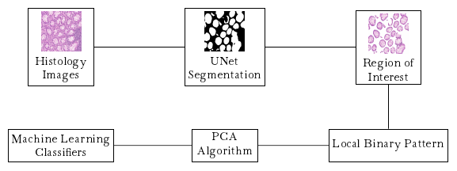

# Gland Classification from Histology Images 

This repository is about gland classification from histology images 
using local binary pattern and machine learning classifiers


### Prerequisites

```commandline
pip install numpy pandas torch torchvision scikit-learn scikit-image kagglehub
```

### Installation
The dataset is publicly available and could be downloaded by running the code in the download.py .

```commandline
python download.py
```
In order to extract region of interests and compute the local binary descriptors, you need to run the following command:
```commandline
python utils.py
```
The above code will serialize the set of descriptors along with their label

You can now run the classification algorithms.
```commandline
python main.py
```
#### Remark

Although we do not cover segmentation at this stage, we provide a pre-trained UNet model
that we have trained for many epochs using A100 GPU.
